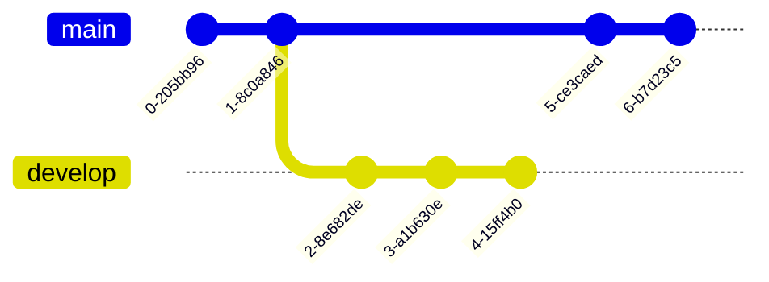
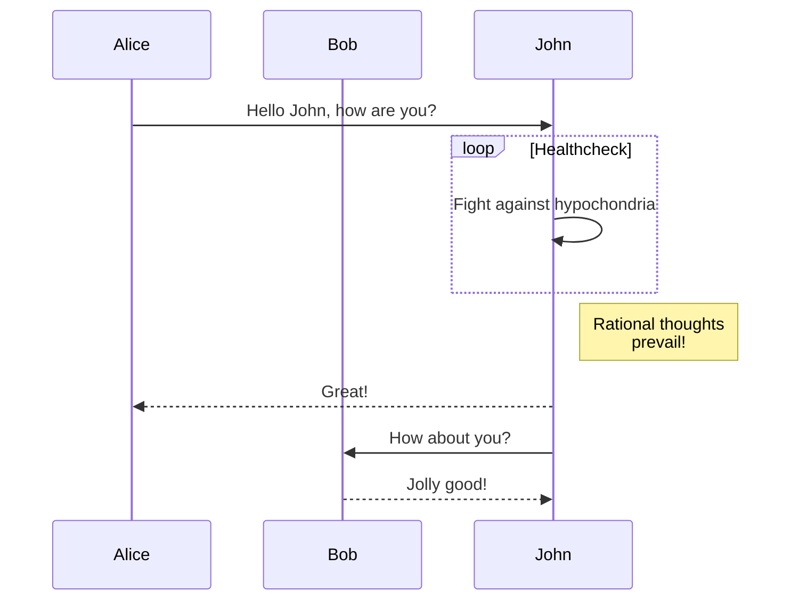
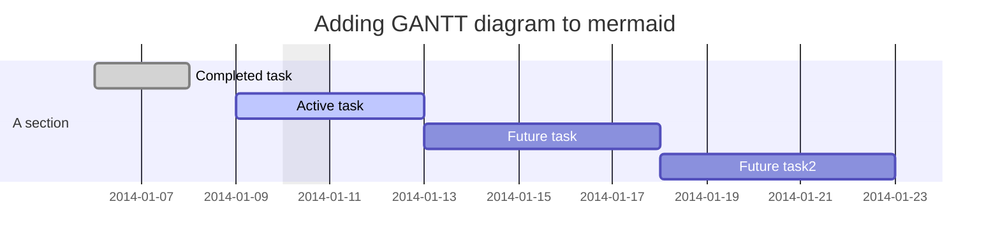
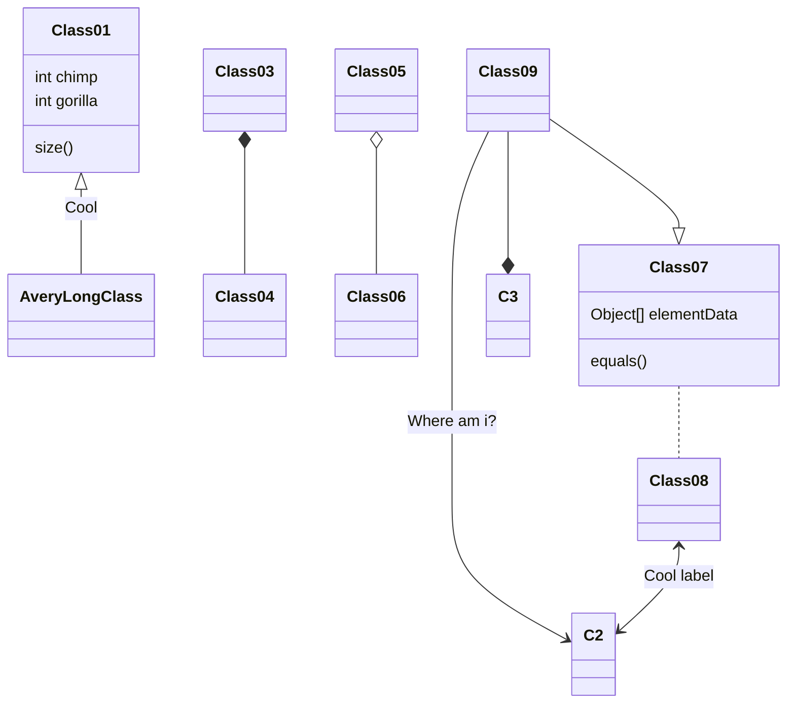
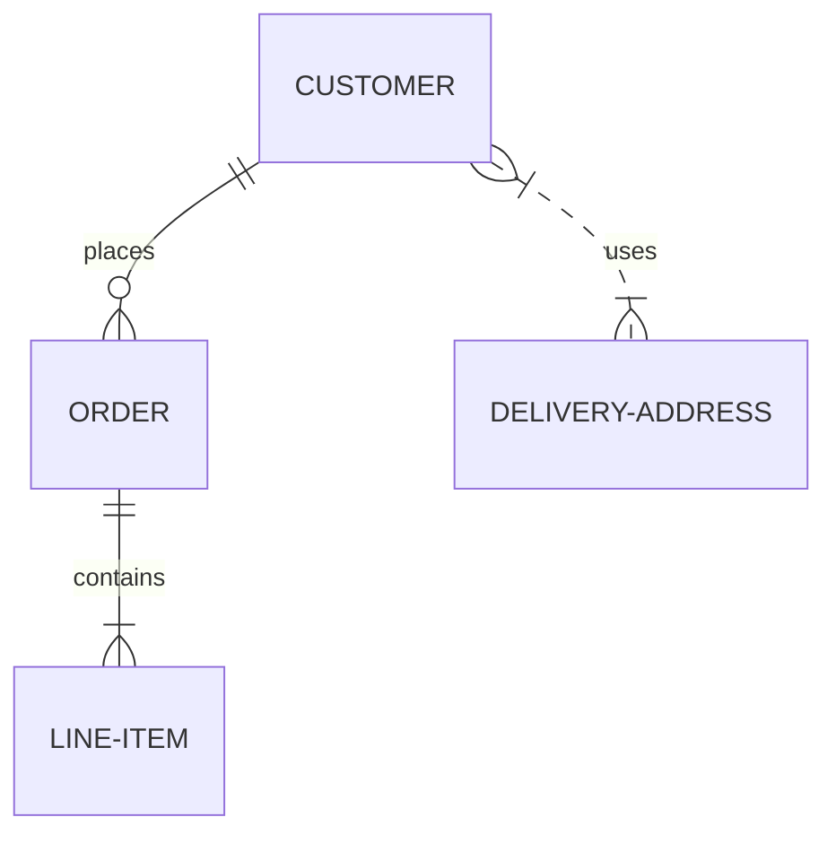
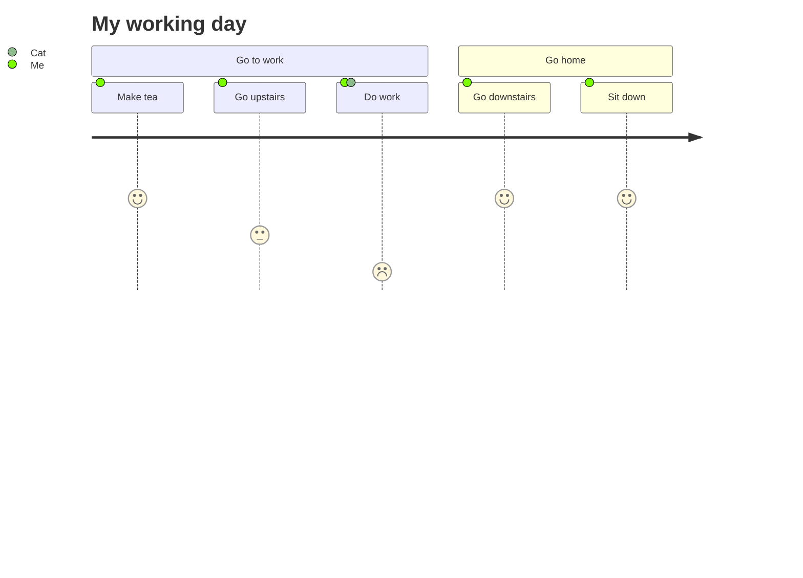

 
+++

title = "Guide for writing markdown slides"
description = "A Hugo theme for creating Reveal.js presentations"
outputs = ["Reveal"]
aliases = [
    "/guide/"
]

+++


# A good title
## Subtitles are important
**Talk @ Somewhere**

🎤 *Gianluca Aguzzi*

📧 [gianluca.aguzzi@unibo.it](mailto:gianluca.aguzzi@unibo.it)

{}
Don't forget to thank the audience.
{}

---

# Headers

# H1
## H2
### H3
#### H4

---

# Text

normal text

`inline code`

*italic*

**bold**

**_emphasized_**

*__emphasized alternative__*

~~strikethrough~~

[link](http://www.google.com)

---

# Lists and enums

1. First ordered list item
1. Another item
    * Unordered sub-list.
    * with two items
        * another sublist
            1. With a sub-enum
            1. yay!
1. Actual numbers don't matter, just that it's a number
  1. Ordered sub-list
1. And another item.

---

# Inline images


---

## Fallback to shortcodes for resizing

Autoresize specifying

* `max-w` (percent of parent element width) and/or `max-h` (percent of viewport height) as max sizes , and
* `width` and/or `height` as *exact* sizes (as percent of viewport size)



---

## Low res, plain markdown


---

## Hi res, plain markdown


---

## Low res, default



---

## Hi res, default



---

## Low res, enlarged horizontally



---

## Low res, enlarged vertically



---

## Hi res, reduced horizontally



---

## Hi res, reduced vertically



---

## Hi res, reducing maximum expansion horizontally



---

## Hi res, reducing maximum expansion vertically



---



# Large images as background
## (May affect printing)

---



# Also available with blur and custom transitions
## (May affect printing)

---

# $$\LaTeX{}$$


Inline equations like $E=mc^2$

$$\frac{n!}{k!(n-k)!} = \binom{n}{k}$$  

---

# Code snippets


```scala
val x = pippo
```

```python
elements = [1, 2, 3, 5, 6]
print(elements[:2])
```
```go
package main
 
import "fmt"
 
func main() {
    fmt.Println("Hello world!")
}
```

---

# Tables

Colons can be used to align columns.

| Tables        | Are           | Cool  |
| ------------- |:-------------:| -----:|
| col 3 is      | right-aligned | $1600 |
| col 2 is      | centered      |   $12 |
| zebra stripes | are neat      |    $1 |

There must be at least 3 dashes separating each header cell.
The outer pipes (|) are optional, and you don't need to make the 
raw Markdown line up prettily. You can also use inline Markdown.

---

# Quotes

> Multiple
> lines
> of
> a
> single
> quote
> get
> joined

> Very long one liners of Markdown text automatically get broken into a multiline quotation, which is then rendered in the slides.

---

# Fragments

* 
* 
* 

---

{}
# Mermaid checks 


---



---


---



---



---



{}